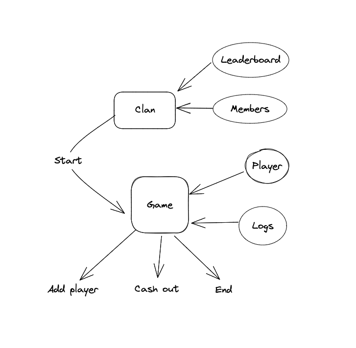
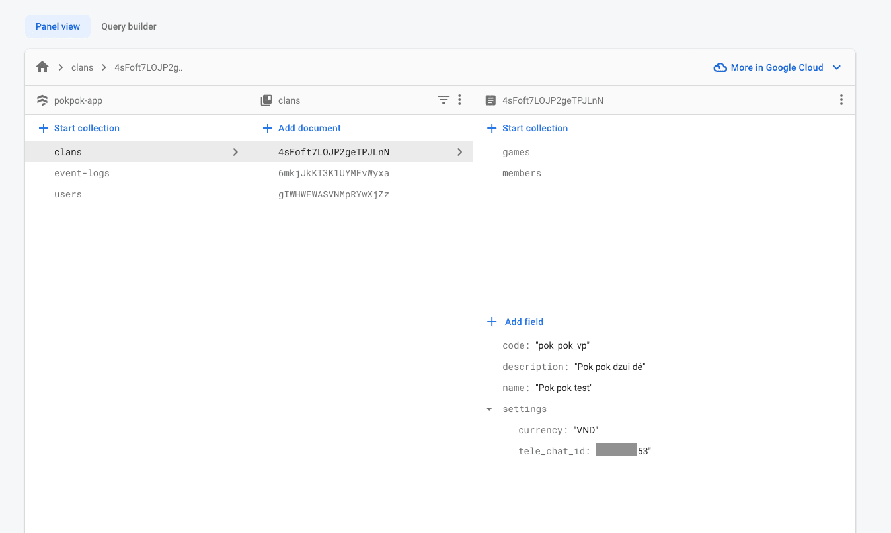
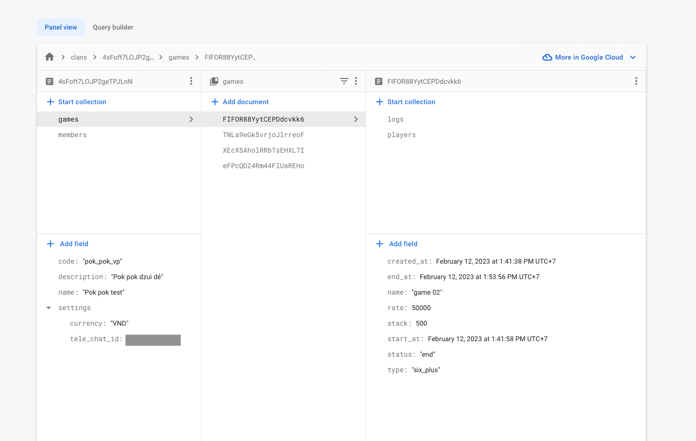
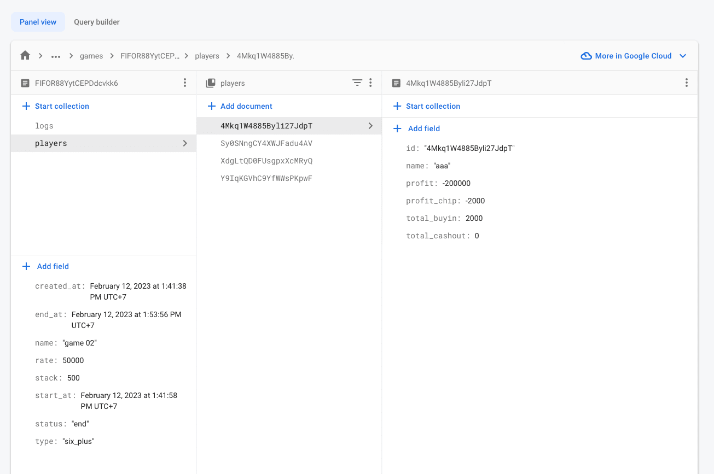
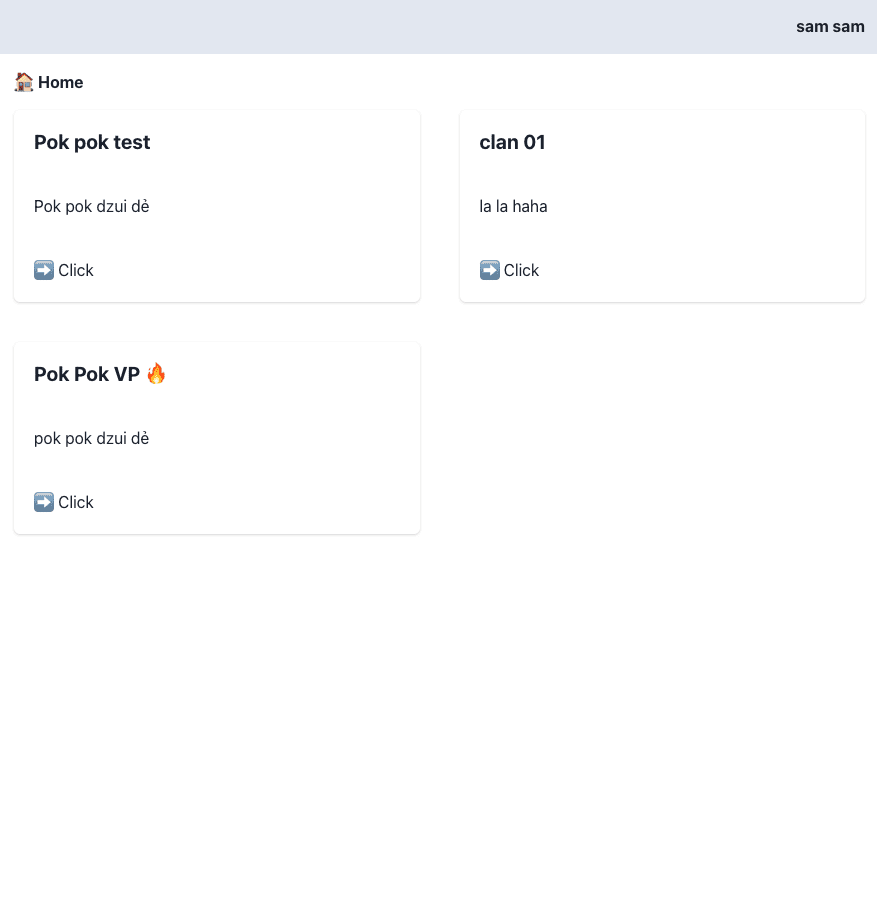
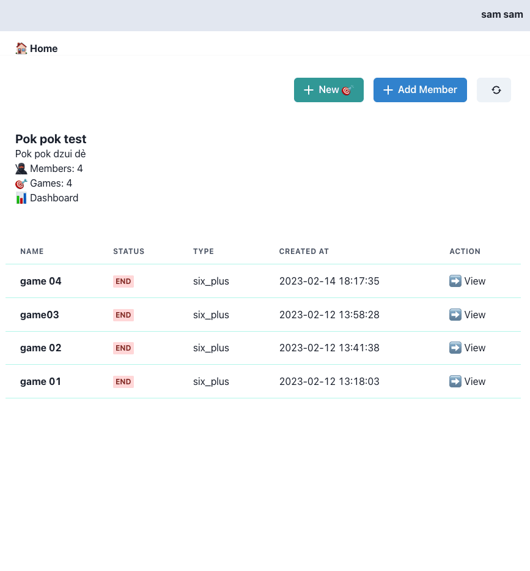
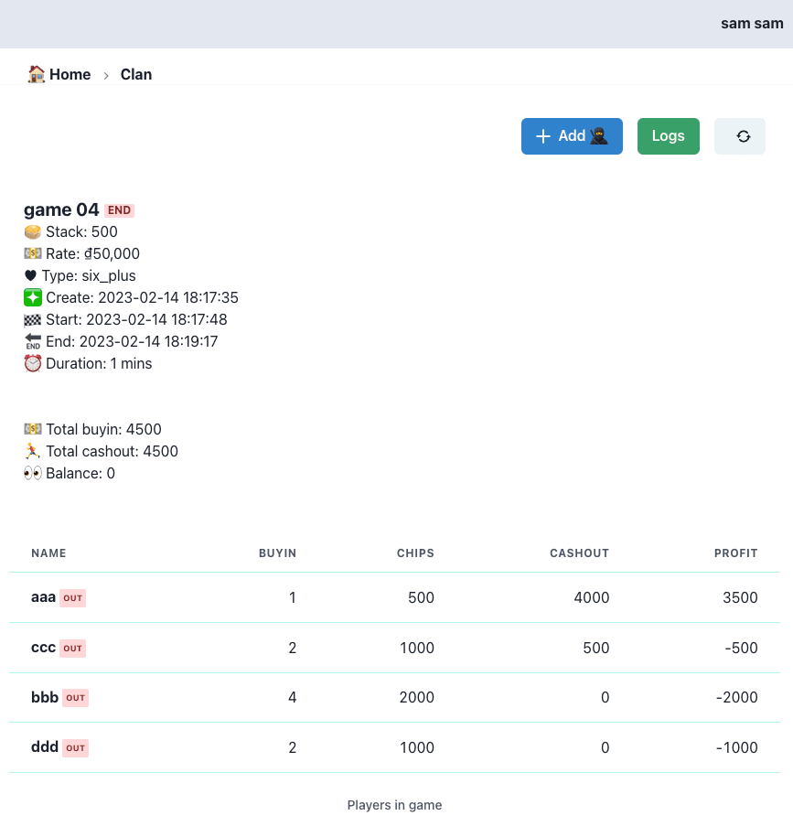
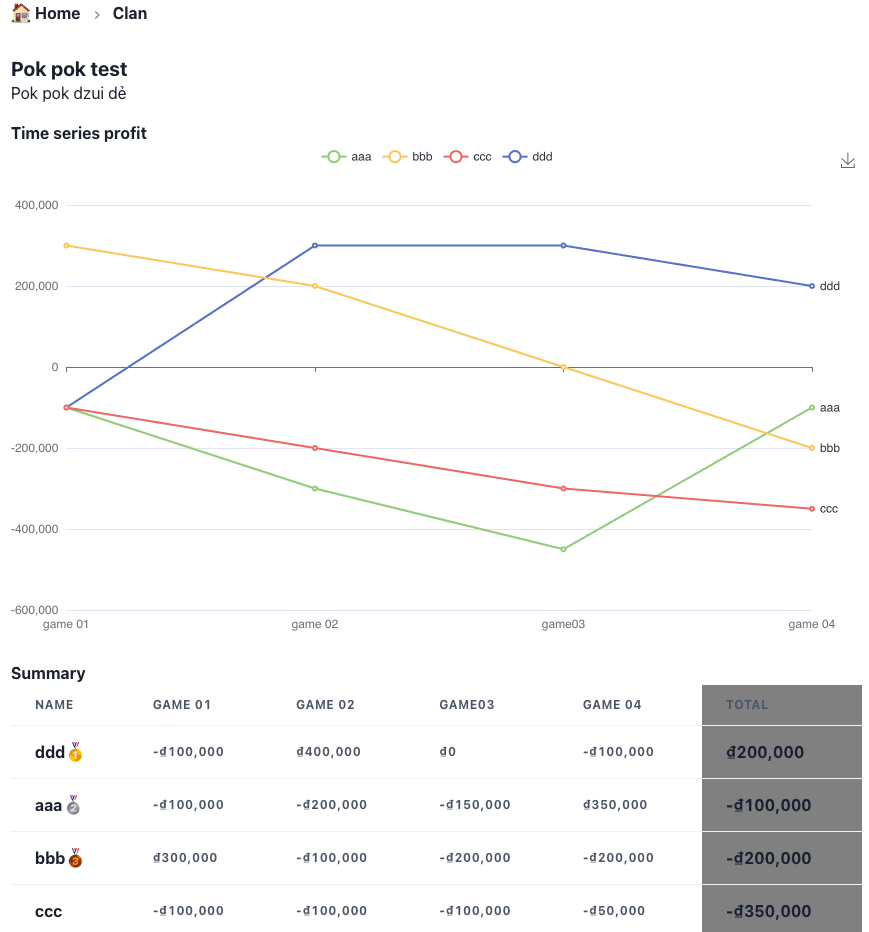

Pok Pok app

Check out repo:
- Backend https://github.com/chuongtrh/pokpok-api
- Web app https://github.com/chuongtrh/pokpok-app

Stacks:
- Web: Next.js, Charka-ui, PWA
- API: oak + denojs
- DB: firestore

## Installation

 - deno 1.30.0

## Getting Started

First, setup file **.env** from *.env.example*

Example:
```json
PORT=5200
JWT_SECRET="jwt_secret_key"
FIREBASE_CONFIG={"type": "service_account","project_id": "pokpok-app","private_key_id": "8922e72***","private_key": "","client_email": "***@pokpok-app.iam.gserviceaccount.com","client_id": "***","auth_uri": "https://accounts.google.com/o/oauth2/auth","token_uri": "https://oauth2.googleapis.com/token","auth_provider_x509_cert_url": "https://www.googleapis.com/oauth2/v1/certs","client_x509_cert_url": "https://www.googleapis.com/robot/v1/metadata/x509/firebase-adminsdk-xoqfa%40pokpok-app.iam.gserviceaccount.com"}

TELEGRAM_BOT_ID="***"
WEB_APP_URL="***"
```
FIREBASE_CONFIG is a private key json generate from your service account:
1. In the Firebase console, open Settings > Service Accounts.
2. Click Generate New Private Key, then confirm by clicking Generate Key.
3. Securely store the JSON file containing the key.

Run the development server:
```bash
deno task dev
```
API ready at [http://localhost:5200](http://localhost:5200)

## Deploy

Deploy into Deno deploy service.

More detail: https://deno.com/deploy

Setup a new project and link with github repo to deploy.

## Usecase


## Firestore schema





## Features
- [x] Init api with deno using OAK => https://deno.land/x/oak@v11.1.0
- [x] Hot reload with denon https://deno.land/x/denon@2.5.0
- [x] Connect db firestore => https://deno.land/manual@v1.30.0/basics/connecting_to_databases#connect-to-firebase-with-the-firestore-npm-module
- [x] Implement logic app
- [x] Sent noti into telegram channel
- [x] Login with google
- [x] JWT token
- [x] Dashboard
- [x] Chart => https://echarts.apache.org/en/index.html
- [x] PWA https://github.com/shadowwalker/next-pwa

## Screenshot






## Author
chuongtrh@gmail.com
